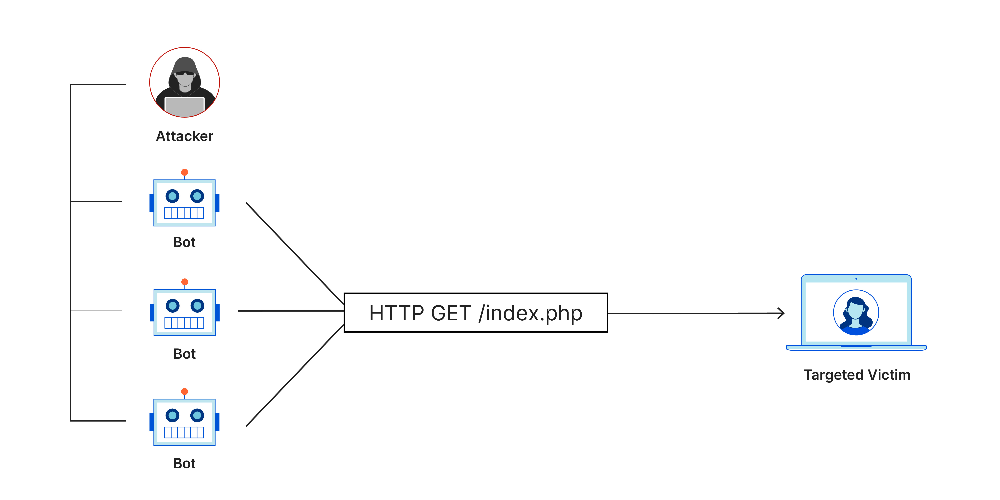

# Distributed Denial of Service (DDoS) Attack

A Distributed Denial of Service (DDoS) attack is a type of denial of service attack in which the incoming traffic flooding the victim so that it cannot respond to legitimate traffic. This project is a simple implementation of a DDoS attack using Python and Scapy.




## Table of Contents

- [Getting Started](#getting-started)
- [Requirements](#requirements)
- [Usage](#usage)
- [Acknowledgments](#acknowledgments)

## Getting Started

To get started with the project, simply clone the repository to your local machine:

```
git clone https://github.com/Himangshu30/DDOS-ATTACK
```

## Requirements

- Python 3.9 or higher
- Scapy 2.4.5 or higher
- Nslookup {optional}
- Linux or Windows

## Usage

To use the project, follow these steps:

- Open the terminal and run the following command:
- `cd ddos-attack`
- `pip install -r requirements.txt`
- `python3 ddos.py`

- Enter the _IP-address_ of the target Website/Machine and Port number [use `nslookup` to find the IP address of the target website or use any other online website to find the IP address of the target Website/Machine.]
- Thats it! The attack will start automatically.


## Acknowledgments

- [Python](https://www.python.org/)
- [Scapy](https://scapy.net/)
- [NSLookup](https://www.nslookup.io/)
